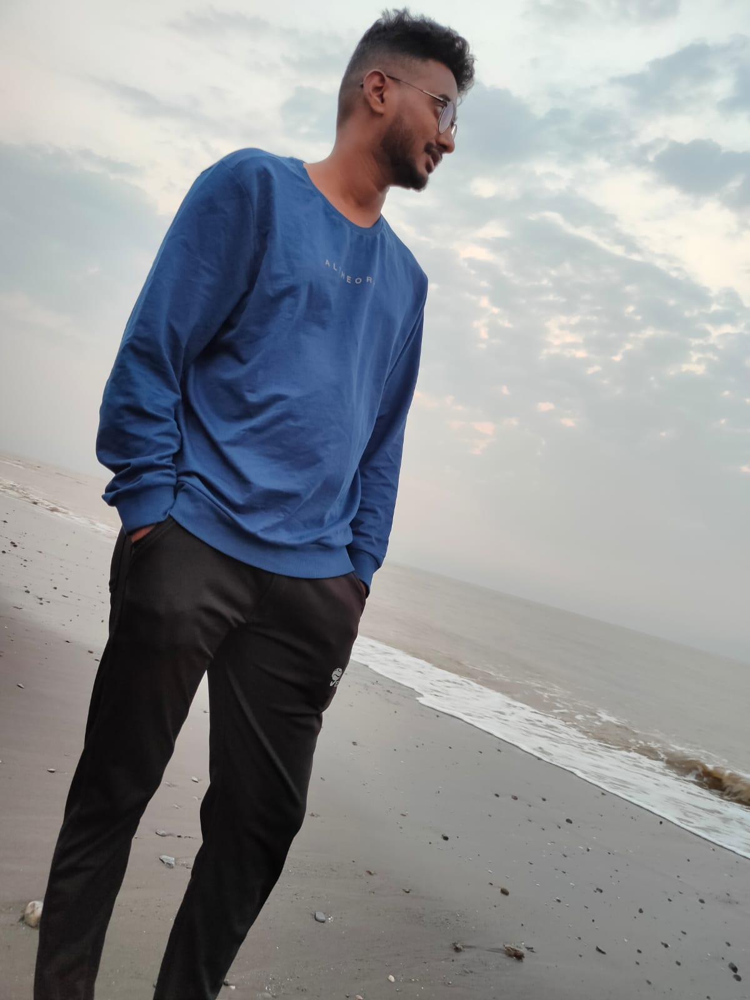

# Maheswar Reddy Polam

I have a collection of over 300 different rare coins. My goal is to find a penny from the first year the United States produced them.

-------------------------------------------------------------------------------------------------------------

# Sports Table

|**Sport name**| **reason for playing**                                   | **hours of playing**|
|:-------------|:-------------------------------------------------------: |--------------------:|
| Basketball   | promotes speed, agility, strength, power and endurance.  | 1 hour              |
| tennis       | Tennis is a good for health, fitness and agility.        | 2 hours             |
| Hiking       | Hiking reduce your risk of heart disease and stroke.     | 1 hour              |
| Swimming     | Swimming is a great stress reducer.                      | 30 minutes          |

-------------------------------------------------------------------------------------------------------------

# My favourite quotes from the scientists

> "The important thing is not to stop questioning. Curiosity has its own reason for existing."
>
> -- *Albert Einstein*

> "Science knows no country, because knowledge belongs to humanity, and is the torch which illuminates the   world."
>
> -- *Louis Pasteur*

 

